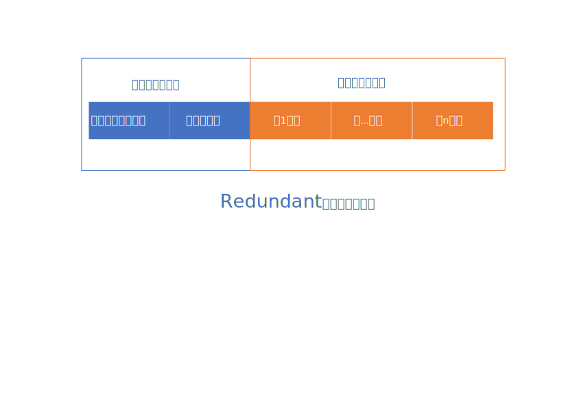

## 第一章 mysql的结构

### mysql client, mysql server, 存储引擎

1. 客户端

用户通过客户端可以和mysql server进行通信，客户端和服务器之间通信的方式包括：

- TCP/IP 

- 命名管道和共享内存（windows）

- unix域套接字文件

2. 服务器

服务器的功能包括：

- 连接管理

- 查询缓存

- 语法解析

- 查询优化

3. 存储引擎

- 表是一个逻辑概念

- mysql使用存储引擎存储表的物理机构。mysql中使用存储引擎进行数据的存储和提取，不同存储引擎管理的表的存储结构不同，存储算法不同

- 常用的存储引擎包括：

  - InnoDb：具备外键支持功能的事务存储引擎

  - myISAM：非事务处理存储引擎

  - memory: 置于内存的表 


## 第三章 字符集和比较规则

1. 字符与二进制数据

- 计算机只能存储二进制数据

- 二进制数据不可读，字符集可读。在使用过程中使用字符集，在存储的时候存储二进制数据。

2. 编码和解码

- “码”只的是二进制码，编码的意思指“编为二进制码”

- 编码：将字符映射为二进制数据

- 解码：将二进制数据映射为字符

3. 字符集

- 需要把那些字符映射成二进制数据？

- 如何映射？

- 字符集用来描述某个**字符范围**的的**编码规则**。

- utf8和utf8mb4，完整的utf8字符集需要1-4个字节进行表示，常用的utf8字符需要1-3个字节表示。在mysql中utf8是utf8mb3的别名。

4. 比较规则

如何比较两个字符的大小呢？

- 二进制比较规则，基于二进制编码进行比较

- 基于字符集制定的比较规则

## 第四章 InnoDB记录结构

在mysql中以记录为单位向表中插入数据，记录在磁盘上的存储方式被称为“记录格式”，在InnoDB存储引擎有四种记录格式：

- compact

- Redundant

- Dynamic

- Compressed

### compact记录格式

compact记录格式如下图所示：


各字段含义如下：

- 变长字段长度列表：存储记录中所有变长类型字段实际数据长度

- NULL值列表：统计表中所有可能为NULL的列，每一个NULL列对应一个二进制位，如果记录中该字段为NULL，则对应的二进制列为1，否则为0

- 记录头信息

- 真实数据记录：除了用户自定义的真实数据记录，mysql会为每一各记录默认添加一些列(row_id, t_id, roll_pointer)


### redundant记录格式

redundant记录格式如下图所示：



各字段含义说明：

- 字段长度偏移列表：记录各列数据真实值在真实数据部分的偏移量


## InnoDB索引页

页是InnoDB管理存储空间的基本单位，一般为16KB。mysql以页为单位在内存和磁盘之间读写数据。


## 第六章 B+树索引

B+树：包括用户记录的数据页和目录项记录的数据页
目录项记录的页记录着子页最小主键值和页码，用户记录的数据页记录着用户数据。

### 1. primary key 和 unique index

在mysql中主键和唯一索引的区别如下：  

1. 在一个表中只能有一个主键，但是可以有多个唯一索引。例如数据表A中包含列a, b, c，可以在列b、c上分别设置唯一索引
2. 在列上设置主键时，该列不能为null，但是设置唯一索引的列可以为null。当在列a上设置唯一索引时，列a中不能存在相同的值。在mysql中，列a不同行中可以同时为Null，此时将null视为不同的null值。

 

### 2. unique index

  1. 在mysql中可以使用多个列创建唯一索引，创建方法如下：

 

```SQL
create table votes (

    `id` int NOT NULL AUTO_INCREMENT,

    `user` VARCHAR(11),

    `email` VARCHAR(11),

    `address` VARCHAR(11),

    primary key (`id`),

    UNIQUE index `unique_index` (`user`, `email`, `address`)

);

```

 

增加唯一索引：  

​        ALTER TABLE `votes` ADD UNIQUE `unique_index`(`user`, `email`, `address`);

 


插入数据：

 

```SQL
insert into  demo.votes(`user`, `email`, `address`) values ('a', 'b', 'c');  --ok

insert into  demo.votes(`user`, `email`, `address`) values ('a', 'b', 'c');  --error

insert into  demo.votes(`user`, `email`, `address`) values ('a', 'b', 'd');  --ok

insert into  demo.votes(`user`, `email`, `address`) values ('a', 'b', null); --ok

insert into  demo.votes(`user`, `email`, `address`) values ('a', 'b', null); --ok

```

### 3. 索引

 生成索引必须完成以下两个动作：

  - 下一个数据页中用户记录的主键值必须大于上一个页中用户记录的主键值，前后页使用双向指针连接  
    - 给所有的页建立一个目录项，每一个目录项包含两部分：  

      1. 页的用户记录中最小的主键值  

      2. 页号  

### 4. 聚簇索引

 聚簇索引有如下两个特点：  

   - 使用记录主键值的大小进行记录和页的排序  
     - 页内的记录按照主键的大小排序成一个单项链表，业内的记录被分为几组，每个组中主键值最大的记录在页内的偏移量放在页目录中
     - 存放用户记录的页也是根据页中用户记录的主键大小顺序排成一个双向链表
     - 存放目录项记录的页分为不同的层级，在同一层级中的页也是根据页中目录项记录的主键大小顺序排成一个双向链表
   - B+树的叶子节点存储的是完整的用户记录。
     我们把具有这两个特点的B+树称为完整的用户记录。聚簇索引就是数据的存储方式：“索引即数据，数据即索引”。

​    二级索引：以非主键列的大小作为排序规则而建立的B+树需要执行回表操作才可以定位到完整的用户记录，这种B+树也被称为是二级索引或者辅助索引。在建立二级索引时，实际使用（索引列，主键）进行排序。
​    
​    联合索引：同时以多个列的大小作为排序规则，为多个列建立索引，这种索引称为联合索引

### MyISAM中的索引方案

    1. 将表中的记录按照插入顺序存放到一个文件中。即数据文件
        2. 将索引信息存放另外一个文件中，称为索引文件。索引的叶子节点存放的是主键值和行号。通过行号在数据文件中快速定位到数据。

### 5. 索引的代价

1. 每建立一个索引都会生成一个B+数，消耗存储空间
2. 每当对表中数据进行增删改时，都要修改B+树索引
3. 每当执行查询操作时，根据使用不同索引执行查询的时间成本生成执行计划，如果索引太多会增大分析成本，影响性能

### 6. 索引用户快速查找和排序数据

- 使用联合索引排序的注意事项：order by 后面的列必须和索引列的顺序相同

不适用排序的情况：

- 索引列排序，各排序列的排序规则是一致的
- 排序中包含非一个索引的列
- 排序列在联合索引中不连续
- 排序列不是以单独的列名出线，比如对排序列进行函数操作
- 用来形成扫描区间的列和排序列不同

分组和排序的限制情况相同

### 如何创建索引

- 只为出现在where字句中的列、order by或者group by中的列创建索引。
- 索引列中不重复值的个数越少越好
- 索引列的类型尽量小
- 为列建立前缀索引
- 尽量使用覆盖索引

什么是覆盖索引？索引中已经包含所有需要读取的列的查询方式称为覆盖索引

### 6. Mysql访问方法


1. const(n)

const访问方法只能在主键列或者唯一二级索引列与一个常数进行比较才能实现。如果主键列和唯一二级索引列又多个列构成，则只有在索引列中的每一列都和常数相等才能实现


2. ref(nx)

   - 普通的二级索引，索引列和搜索条件进行等值比较后可能会匹配到多条二级索引记录，这种情况的访问方法称为ref。


   - 如果二级索引列允许存储null值，由于在mysql中两个null值不同，因此`key is null`可能会匹配多个索引记录，此时访问方法一定是ref
   - 索引列中包含多个二级索引列，只要最左边连续的列是与常数等值比较，可以采用ref方法

3. ref_or_null
   二级索引记录的值是常数或者null时，此时使用`ref_or_null`访问方法，例如

   ```sql
   select * from single_table where key1 = 'abc' or key1 is null
   
   ```

4. range(nxy)

   - 当扫描区间为多个单点扫描区间或者范围扫描区间时，使用range访问方法。
   - 只有一个单点扫描区间的方法不能称为range，扫描区间为(-oo, +oo)时的访问方法也不是range
     例如：

   ```sql
   select * from single_table where key2 in (1438, 6328) or (key2 >= 38 and key2 <= 79)
   
   ```

5. index
   当查询信息都在联合索引中时，搜索条件也在联合索引中时，使用联合索引即可完成所有的查询动作，此时使用查询方法index

 

6. all

 

   全表查询

 

## 第十八章 事务

1. 隐式提交
   导致隐式提交的情况：

   - 执行DDL语言
   - 隐式使用或者修改mysql数据库中的表
   - 当一个事务还没有提交或者回滚，重新使用start transaction或者begin等语句，会重新开启一个事务，隐式提交上一个事务。
   - 将 autocommit设置为true
   - 使用lock tables, unlock tables等关于锁定的语句
   - 其他一些情况


## 第十九章 Redo日志

1.   用户在提交事务的时候将redo日志写入磁盘而非数据页，因为：
     -   redo日志占用的空间较小
     -   redo日志是顺序写入磁盘，顺序IO性能好。
2.   redo日志的格式是什么？
     -   type: redo日志的类型
     -   spaceId: 表空间ID
     -   pageNum: 页号
     -   data：redo日志的具体内容

## 第二十一章 事务的隔离级别和MVCV

1. 脏写
   一个事务修改了另外一个为提交的事务，会产生脏写现象
2. 脏读
   一个事务读取了另外一个未提交事务的数据，会产生脏读现象
3. 幻读
   一个事务根据索索条件查询记录，但是在该事务未提交时，另外一个事务写入符合搜索条件的数据，此时产生幻读
4. 四种隔离级别
   读未提交，读已提交，可重复读，序列化。mysql默认的隔离级别是可重复读。
5. readView的时机不同
   - 使用读已提交时，每一次读取数据都会生成一个readView.
   - 使用可重复读是，只有在第一次读的时候才会生成一个readView，并且之后的读数据都使用该readView
   - 普通的select查询时，MVCC才会生效

### 版本链

聚簇索引记录都会包含两个隐藏列，trx_id和roll_pointer。

- trx_id：一个事务每次对某条聚簇索引记录进行改动，都会把该事务的事务ID赋值给trx_id隐藏列

- roll_pointer：每次对聚簇索引记录进行修改时，都会把旧版本写入到undo日志中。通过roll_pointer指向该undo日志。

每次对记录进行修改都会记录一条undo日志。每条undo日志也都有一个roll_pointer指向上一个undo日志。通过undo日志穿成链表，构成版本链。

undo日志只记录被修改列的信息，如果没有一个列的修改信息，则该列在本次事务中未修改，和上一个undo日志中的结果保持一致。

### readView

readView解决的核心问题：版本链中的哪个版本是当前事务可见的？

- m_ids：当前系统中活跃的读写事务的事务ID列表

- min_trx_id：生成readView时，当前系统中活跃的读写事务中最小的事务Id

- max_trx_id：生成readview时，系统应该分配给下一个事务的事务Id值

- creator_trx_id：生成该readView的事务的事务Id

按照如下步骤判断记录的某个版本是否可见：

- 如果被访问版本的trx_id = creator_trx_id，则当前事务访问自己的记录

- 如果被访问版本的trx_id属性值小于min_trx_id，表示该版本已提交，事务可以访问

- 如果被访问版本的trx_id属性值大于或者等于max_trx_id，表示该版本在当前事务生成后才开启，不能访问

- 如果被访问版本的trx_id在min_trx_id和max_trx_id之间，则需要判断trx_id是否在m_ids列表中。如果在，说明该版本还是活跃的，不能访问。如果不再，说明事务已经提交，该版本可以访问。

如果该记录对当前事务不可见，则顺着版本链找到下一个版本，并继续执行上述步骤来判断可见性。依次类推，直到找到可见的版本。如果都不可见，则该记录对本事务不可见。


# 第二十二章 锁

### 22.1 解决并发事务问题的两种基本方式

1. 读-读

   并发事务读取相同数据，无影响

2. 写-写

   并发事务对相同数据做修改。此时会发生脏写问题：记录1初始状态，事务A更新记录1，然后事务B更新记录1，事务B回滚记录1初始状态。此时发生脏写，事务A的更新没有生效。

   这种情况可以通过加锁来解决。

3. 读-写

   事务A读数据，事务B写数据，此时会产生脏读、不可重复读和幻读三种情况。此时有两种解决方案：

 - 方案1：读操作使用MVCC技术，写操作则加锁
 - 方案2：读写操作都加锁

#### mysql的读写操作

1. 一致性读
   事务利用MVCC进行的读取操作称为一致性读，所有普通的select语句在读已提交和可重复读隔离级别下都算是一致性读。

2. 锁定读
   select *** lock in share mode 
   select *** for update

3. 写操作

   - delete操作：先查找，再获取记录的X锁，然后修改标志位删除记录
   - update操作：先查找，
     - 未修改键值，更新列存储空间没有发生变化：先查找，获取记录X锁，然后更新
     - 未修改键值，更新列存储空间发生变化：先查找，获取记录X锁，然后删除记录，插入记录。
     - 修改键值，先delete，再插入
   - insert 新插入的记录受到隐式锁的保护
4. mysql读数据的方式

   - 一致性读
     事务利用mvcc进行的读取操作称为一致性读。在read committed和repeatable read两种隔离级别下，所有的普通select语句都是一致性读。

   - 锁定读
     给记录加S锁：select ... lock in share mode;
     给记录加X锁：select ... for update;
5. mysql写数据的方式

   - delete
     对记录进行删除操作的步骤：先定位待删除记录在B+树中的位置，然后再获取这条记录的X锁。可以看做是获取X锁的锁定读。

   - update
     - 被更新列所占用的存储空间在修改前后未发生变化，则先在B+树中定位到该记录的位置，然后再获取该记录的X锁，最后在原记录的位置进行修改
     - 被更新列所占用的存储空间在修改前后发生变化，则先在B+树中定位到这条记录的位置，然后获取该记录的X锁，之后把该记录彻底删除掉，最后插入新记录，同时将被删除记录关联的锁转移到新记录上
     - 修改记录的键值，相当于在原记录上执行delete操作，再执行insert操作。加锁操作按照delete和insert规则进行。

   - insert
     一般情况下，新插入的一条记录受隐式锁保护。

### 22.3 Innodb引擎中的表级锁

   表级锁包括：元数据锁（MDL）、表级别的X锁和S锁、意向锁

1. MDL锁

   - MDL是一种隐式锁，由Innodb自动添加，无需用户操作
   - MDL锁主要用于处理DDL（alter table, drop table）和DML（select, update, insert）之间的冲突：
     - 当事务A对表执行DDL语句时，事务B中的DML语句阻塞
     - 当事务A对表执行DML语句时，事务B中的DDL语句阻塞

2. 表级别的X锁和S锁

   - 表级别加锁:
     - 读锁：lock tables table_name read
     - 写锁：lock tables table_name write

   - 表级别解锁
     unlock tables

   - 表锁、行锁的兼容性

    | 兼容性 | 表S锁 | 表X锁 | 行S锁 | 行X锁 |

    | ------ | ---- | ------ | ---- | ----- |

    | 表S锁 |  兼容  | 不兼容 | 兼容  | 不兼容 |

    | 表X锁 | 不兼容 | 不兼容 | 不兼容 | 不兼容 |

    | 行S锁 | 兼容   | 不兼容 | 兼容  | 不兼容 |

    | 行X锁 | 不兼容 | 不兼容 | 不兼容 | 不兼容 |


    - 表锁和行锁的加锁顺序引出的问题

 


   当一个表先加表锁（可以是S锁和X锁），再企图加行锁时，此时可以很方便的根据表锁的类型、状态来判断是否可以加锁成功。

   当一个表先加行锁（可以是S锁和X锁），再企图加表锁时，此时需要先判断表中任意记录是否有行锁。通过意向锁可以方便的判断表中任意记录锁的状态。

 

3. 意向锁

   - 意向锁是一种隐式锁，由存储引擎操作，用户无法操作。意向锁充当行锁和表锁两者之间的桥梁。

   - 什么时候加意向共享锁？
     事务有意向对表中的某些行加共享锁

   - 什么时候加意向排他锁？
     事务有意向对表中的某些行加排他锁

   - 意向锁和意向锁之间的并发性
     意向锁和意向锁之间互不冲突，即IS和IX锁之间可以并发执行

   - 意向锁和表级X、S锁之间的并发性

     | 兼容性 | IS     | IX   |

     | ----- | ---    | ---   |

     | S     |  兼容  | 不兼容 |

     | X     |  不兼容 | 兼容 |

### 22.4 Innodb引擎中的行级锁

1. record lock 记录锁

   记录锁是加在记录上的，包括S锁和X锁

2. gap lock 间隙锁

   间隙锁也是加在记录上的，但是作用却是阻止在当前记录和上一条记录之间新增数据。实现原理如下：假设记录A和C之间相邻，事务1在记录C上则增加间隙锁，如果事务2企图在A和C之间增加记录B，增加记录B时，需要找到记录C简历单向链表关系，此时事务2发现记录C上存在间隙锁，因此增加阻塞，直到间隙锁释放。

   间隙锁之间，间隙锁和记录锁之间不会相互互斥。

3. next key 邻键锁

   邻键锁加在记录上，邻键锁相当于记录锁和间隙锁的合体，能够锁住记录，记录和上一个记录之间的间隙。

   A next-key lock on an index record also affects the “gap” **before** that index record.

4. insert intention lock 插入意向锁

   事务在插入记录时，如果被间隙锁或者邻键锁阻塞，则需要生成一个插入意向锁。当间隙锁或者邻键锁被释放后，插入意向锁获得插入意向，执行插入操作。

   插入意向锁并不会阻止其他事务获取该记录上的任何类型的锁。

5. 隐式锁

   隐式锁主要用在插入场景中，隐式锁主要通过trx_id实现，隐式锁通过延迟生成锁机构提高数据并发性。隐式锁工作原理如下所述：

- trx_id

  聚簇索引记录中存在一个trx_id隐藏列，记录着最后改动该记录的事务的事务id。当事务新插入一条记录时，该记录的trx_id就代表当前事务的事务Id。对于二级索引记录而言，二级索引记录本身没有trx_id隐藏列，但是在二级索引页面的page header部分有一个page_max_trx_id属性，该属性表示对该页面做修改的最大事务Id。

- 情景1 访问聚簇索引

  事务T1插入一条记录S，记录S的trx_id = T1, 事务T2企图对记录S增加S锁或者X锁，事务T2根据记录S的事务Id判断该事务是否活跃。如果不活跃，说明事务T1已经被提交，则可以对该记录加锁；如果活跃，说明事务T1尚未提交，此时事务T2帮助事务T1增加一个对记录S的X锁，锁结构is_waiting属性为false；然后为自己创建一个锁结构，锁接口is_waiting属性为true，然后自己进入等待状态。

- 情景2 访问二级索引

  事务T2访问二级索引记录，并且page_max_trx_id属性值小于当前最小的活跃事务Id，那就说明对该页面所做的修改都已经提交，否则需要在页面中定位到对应的二级索引记录，然后通过回表操作找到对应的聚簇索引记录，然后重复情景1。

- 如何找到当前活跃的事务ID 

  `SELECT * FROM information_schema.innodb_trx`

## mysql innodb引擎是如何加锁的

1. ```sql
   create table table_A (
       int int primary key,
       name varchar,
       age int  
   );
   
   set autocommit = 0 ;
   
   -- 事务1 
   
   select * from table_A where age = 1 for update;
   
   
   -- 事务2
   
   update table_A set name = 'yuan' where age = 3;
   ```

   事务2会阻塞。原因是由于事务1没有使用索引，因此事务1的执行全表扫描，对每一行记录加锁。事务2阻塞。

2. 如何查看mysql的锁信息

   - **show** **engine** innodb status
     - 显示当前数据库中的事务和锁信息
   - **SELECT** * **FROM** performance_schema.data_lock_waits;
     - 显示事务之间的阻塞关系
   - **SELECT** * **FROM** performance_schema.data_locks;
     - 显示系统中锁的状态信息

   结合上述三种信息可以分析出，当前sql执行是否被其他事务阻塞

   


​    


